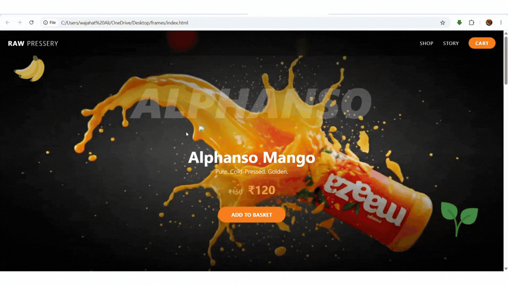

# 🥭 Maaza 3D Website

A visually immersive **3D-inspired Maaza website** created with HTML, CSS and JavaScript.

The project focuses on creating an attractive fruit-drink themed web experience with animated visuals, frame-by-frame animation and a promotional trailer.

---

## 🎬 Project Preview

### Website Preview



---

## 🎥 Maaza Website Trailer

The project also includes a promotional video demonstrating the website experience.

**Video:** `maaza trailer.mp4`

---

## ✨ Features

- 🥭 Maaza-inspired visual design
- 🎨 Modern and attractive UI
- 🎞️ Frame-by-frame animation
- 🖼️ 200+ animation frames
- 🎥 Promotional trailer
- 📱 Responsive web design
- ⚡ Smooth visual experience
- 🌐 Pure frontend implementation
- 🚀 Ready for GitHub Pages deployment

---

## 🛠️ Technologies Used

- **HTML5**
- **CSS3**
- **JavaScript**
- **GIF Animation**
- **MP4 Video**
- **Git & GitHub**

---

## 📂 Project Structure

```text
Maaza-3d-website/
│
├── index.html
│
├── gif.gif
│
├── maaza trailer.mp4
│
├── ezgif-frame-001.jpg
├── ezgif-frame-002.jpg
├── ezgif-frame-003.jpg
├── ...
├── ezgif-frame-200.jpg
│
└── README.md
```

---

## 🎞️ Animation

The website uses a collection of individual frames to create a smooth visual animation.

There are **200 animation frames** in the project:

```text
ezgif-frame-001.jpg
ezgif-frame-002.jpg
ezgif-frame-003.jpg
...
ezgif-frame-200.jpg
```

These frames are used to create the animated visual experience of the website.

---

## 🚀 How to Run Locally

### 1. Clone the repository

```bash
git clone https://github.com/Wajahat5530/Maaza-3d-website.git
```

### 2. Open the project

```bash
cd Maaza-3d-website
```

### 3. Run the website

Open:

```text
index.html
```

in your browser.

---

## 🌐 Live Demo

The website can be deployed using **GitHub Pages**.

Once GitHub Pages is enabled, the website will be available at:

```text
https://wajahat5530.github.io/Maaza-3d-website/
```

---

## 📸 Preview

The project contains animated visual content designed to give the website a modern product-presentation feel.


---

## 🎯 Project Goal

The goal of this project was to experiment with:

- Web animation
- Frame-by-frame image sequences
- Product-focused UI
- Interactive visual storytelling
- Modern frontend design

---

## 👨‍💻 Author

**Wajahat Ali**

GitHub:  
https://github.com/Wajahat5530

---

## ⭐ Support

If you like this project, consider giving the repository a ⭐ on GitHub.

---

## 📜 License

This project was created for learning, experimentation and portfolio purposes.
